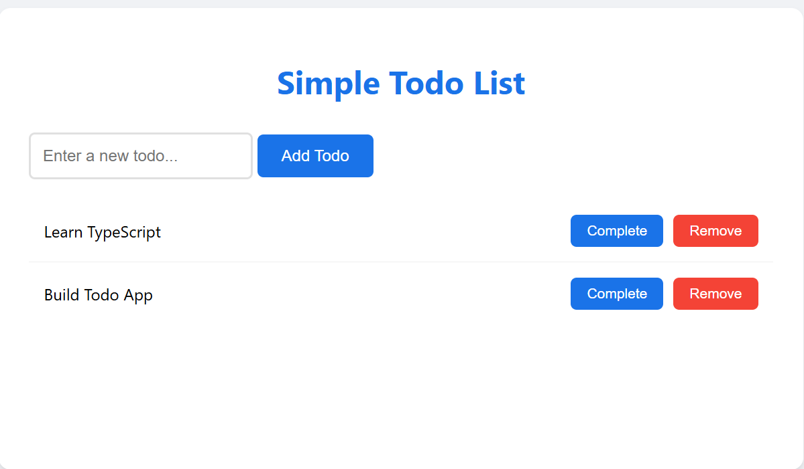
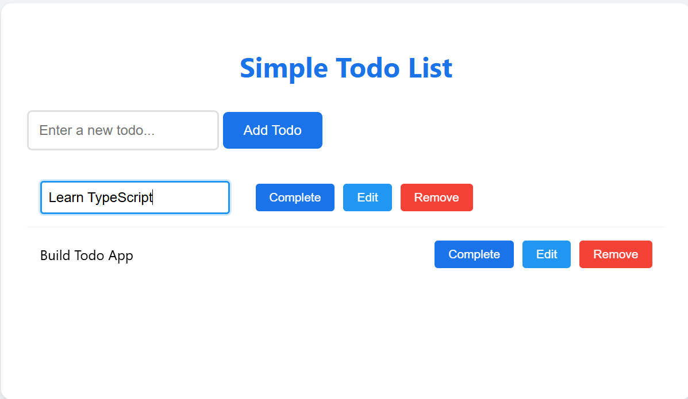
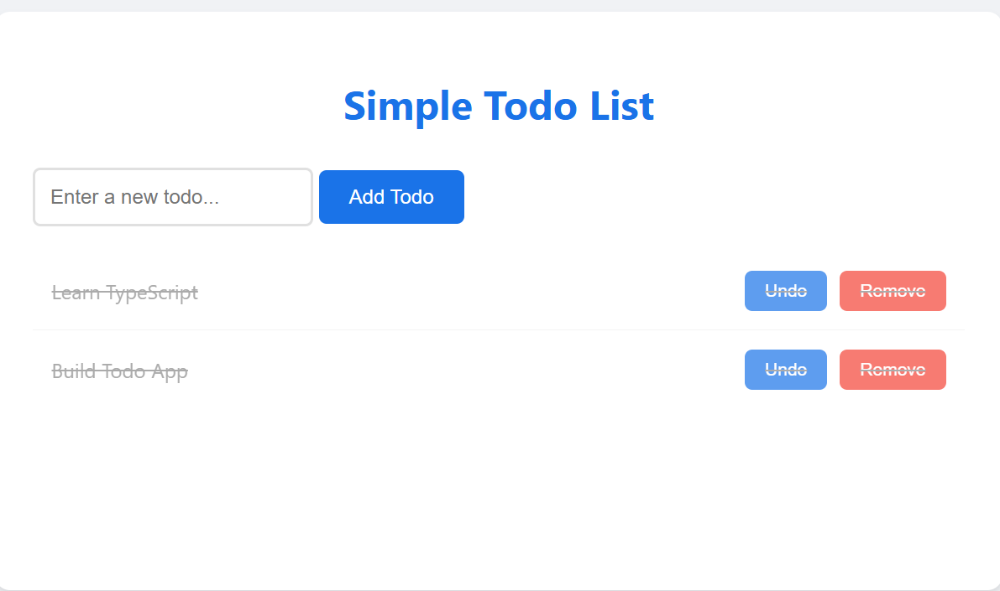

# Simple Todo List Application

A TypeScript-based Todo List application that allows users to manage their tasks with a clean and modern interface.

## Features

- Add new tasks with a dedicated input field
- Remove existing tasks with a single click
- Toggle task completion status (green for complete, red for remove)
- Display all tasks with their status
- Clean and modern user interface
- Responsive design that works on all screen sizes

## Installation

1. Clone the repository:
```bash
git clone https://github.com/YOUR_USERNAME/Simple-Todo-ListAppwithTypescript.git
cd Simple-Todo-ListAppwithTypescript
```

2. Open `index.html` in your web browser

## Usage

1. Open `index.html` in your web browser
2. The application will load automatically
3. To add a new task:
   - Type your task in the input field
   - Click the "Add Todo" button or press Enter
4. To complete a task:
   - Click the green "Complete" button next to the task
5. To remove a task:
   - Click the red "Remove" button next to the task

## Project Structure

- `index.html`: Main HTML file with styling
- `todo.ts`: Main TypeScript file containing the TodoList class and interface
- `todo.js`: Compiled JavaScript file
- `README.md`: Documentation file
- `package.json`: Project configuration
- `tsconfig.json`: TypeScript configuration

## Screenshots

### Main Interface


### Adding a Todo


### Editing a Todo


### Completing a Todo


### Removing a Todo


## Contributing

Feel free to fork this repository and submit pull requests for any improvements or bug fixes.

## License

This project is licensed under the MIT License - see the LICENSE file for details.
